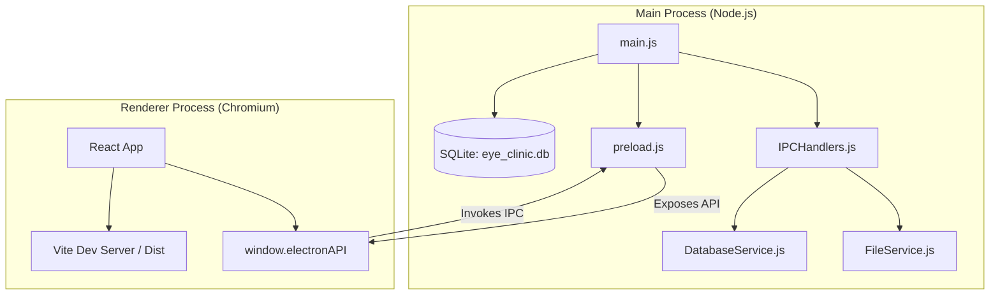
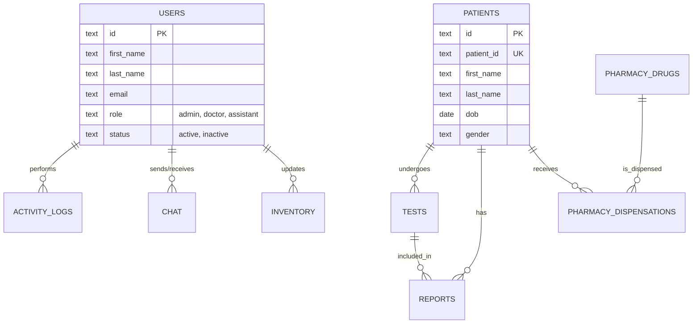

# Eye Clinic Management System (Korenye Eye Clinic)

A state-of-the-art, offline-first desktop application designed for comprehensive eye clinic management. Built with **Electron (v38)**, **React (v19)**, and **SQLite**, the system provides visual field test management, patient records, pharmacy inventory, and advanced reporting.

---

## 🏗️ System Architecture

The application utilizes a multi-process architecture to ensure performance, security, and a seamless desktop experience.



### Key Components:
- **Main Process**: Handles system events, file system access, and database management.
- **Renderer Process**: A modern React-based UI powered by Vite and Tailwind CSS.
- **IPC Bridge**: Secure communication between the UI and system services via a context-isolated `preload.js` script.
- **Database**: Local SQLite storage for high reliability and data privacy.

---

## 📊 Database Schema (ERD)

The system manages complex medical and operational data through a robust relational schema.



---

## ✨ Core Features

### 👨‍⚕️ Medical Management
- **Patient Records**: Centralized management of patient demographic data and medical history.
- **Visual Field Tests**: Dedicated module for uploading and analyzing test data from clinical machines.
- **Automated Reporting**: Generation of professional PDF reports using `jspdf` and `pdf-lib`.

### 📦 Operational Modules
- **Pharmacy & Inventory**: Real-time tracking of medical supplies, medications, and equipment with low-stock alerts.
- **Internal Chat**: Secure internal messaging system allowing staff to communicate instantly across the clinic.
- **Revenue Tracking**: Financial overview and tracking of clinic income from services and dispensations.

### 🔐 Security & Reliability
- **Role-Based Access (RBAC)**: Distinct interfaces and permissions for Administrators, Doctors, and Assistants.
- **Audit Logs**: Deep tracking of all critical system actions for security and accountability.
- **Offline-First**: Full functionality without an internet connection, ensuring the clinic never stops operating.
- **Automated Backups**: Integrated backup service to prevent data loss.

---

## 🚀 Getting Started

### Prerequisites
- **Node.js**: v18 or higher.
- **Operating System**: Optimized for Windows 10/11.

### Installation
1. Clone the repository.
2. Run `npm install` to install dependencies.
3. Run `npm run dev` to start the application in development mode.

### Database Initialization
On the first launch, the system automatically initializes the SQLite database. For manual setup:
```bash
npm run setup-db
```

---

## 📁 Project Structure

- `electron/`: Core Electron application logic, including IPC handlers and window management.
- `src/`: React frontend source code.
    - `components/`: Reusable UI elements and complex modals.
    - `pages/`: Role-specific dashboards and feature pages.
    - `services/`: Frontend wrappers for IPC calls.
    - `hooks/`: Custom React hooks for global state and keyboard shortcuts.
- `database.js`: Primary SQLite database controller and schema definitions.
- `services/`: (Backend) Services for data persistence and file management.

---

## 🛠️ Technology Stack

- **Framework**: Electron + React (via Vite)
- **Styling**: Tailwind CSS
- **Database**: SQLite3
- **PDF Core**: jsPDF, pdf-lib
- **Testing**: Jest, React Testing Library
- **Utilities**: Bcrypt.js (Security), UUID (Identifiers), Puppeteer (Screen capture)

---

Developed for **KORENE EYE CLINIC NIG. LTD.** All rights reserved.
